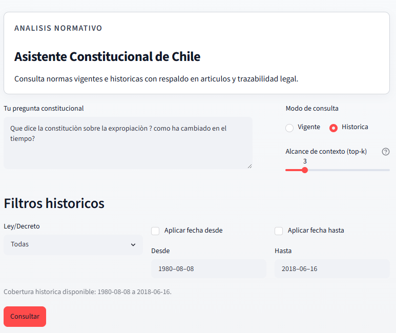
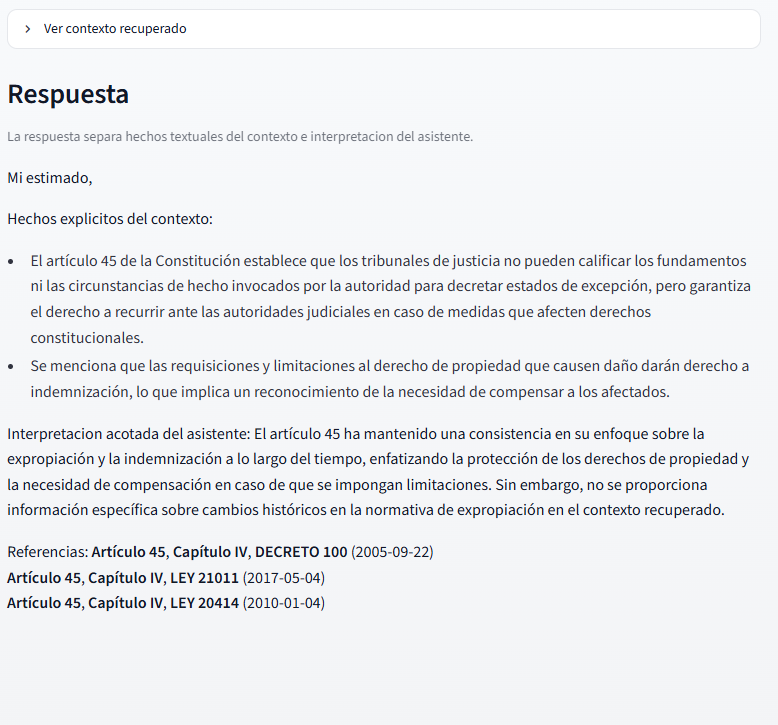

# Cl-Legal-RAG

**Asistente RAG para consultas sobre la Constitución Política de la República de Chile**

Consulta el texto vigente de la constitución y su historia de cambios con precisión jurídica.

---

## Demo Visual

Vista principal de la aplicación:



Ejemplo de respuesta con contexto:



---

## Inicio rápido (3 pasos)

### 1. Requisitos

- Python 3.11+
- `uv` (administrador de dependencias)
- Clave de API de OpenAI (obtén una en [platform.openai.com](https://platform.openai.com))

### 2. Configurar el proyecto

```bash
# Clonar el repositorio
git clone https://github.com/AndresNavarrete/llm_rag_constitucion_chile.git
cd llm_rag_constitucion_chile

# Instalar dependencias
uv sync

# Crear archivo .env con tu clave API
echo "OPENAI_API_KEY=sk-..." > .env
```

### 3. Ejecutar la aplicación

```bash
uv run streamlit run app/main.py
```

Abre `http://localhost:8501` en tu navegador.

---

## Cómo usar

La aplicación tiene dos modos de operación:

**Modo Vigente**
Consulta el texto actual de la Constitución.

**Modo Histórico**
Visualiza cambios en la Constitución a lo largo del tiempo, con filtros por:
- Rango de fechas
- Leyes específicas
- Artículos

---

## Ejecutar con Docker

Si prefieres usar contenedores:

```bash
# Construir imagen
docker build -t cl-legal-rag:1.0 .

# Ejecutar
docker run --rm -p 8501:8501 \
  -e OPENAI_API_KEY=sk-... \
  -v $(pwd)/chroma_db:/app/chroma_db \
  -v $(pwd)/logs:/app/logs \
  cl-legal-rag:1.0
```

---

## Datos e Ingesta

La aplicación descarga automáticamente la fuente de datos de [opensourcechile/constitucion_chile](https://github.com/opensourcechile/constitucion_chile).

Para reingestar datos (por ejemplo, después de actualizar el repositorio raw):

```bash
uv run python scripts/ingest_history.py
```

---

## Monitoreo de costos

La aplicación registra automáticamente el uso de OpenAI. Para ver un resumen:

```bash
uv run python scripts/report_usage.py
```

Los logs se guardan en `logs/openai_usage.jsonl`.

---

## Documentación técnica

Para desarrolladores y mantenimiento del proyecto:

**[docs/AGENT.md](docs/AGENT.md)** — Arquitectura detallada, configuración avanzada, troubleshooting

---

## Buenas prácticas

- Siempre usa `uv run ...` para ejecutar comandos (asegura el entorno correcto)
- No versionices `.env` ni la carpeta `logs/`
- Mantén el repositorio raw (`data/raw/constitucion_chile/`) actualizado
- Reingestar cuando actualices la fuente de datos

---

## Contribuciones

Este proyecto es de código abierto. Si encuentras errores o tienes ideas de mejora, abre un issue o pull request.

---

**Última actualización:** Junio 2026
